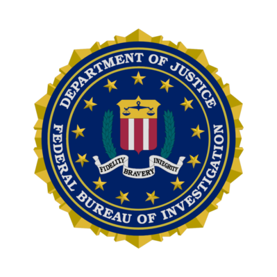

The data was collected by thousands of law enforcement agencies (city, university and college, county, state, tribal, and federal) across the United States, and was organized by the Federal Bureau of Investigation through their Uniform Crime Reporting Program.

The original data source can be accessed [here.](https://ucr.fbi.gov/crime-in-the-u.s)
